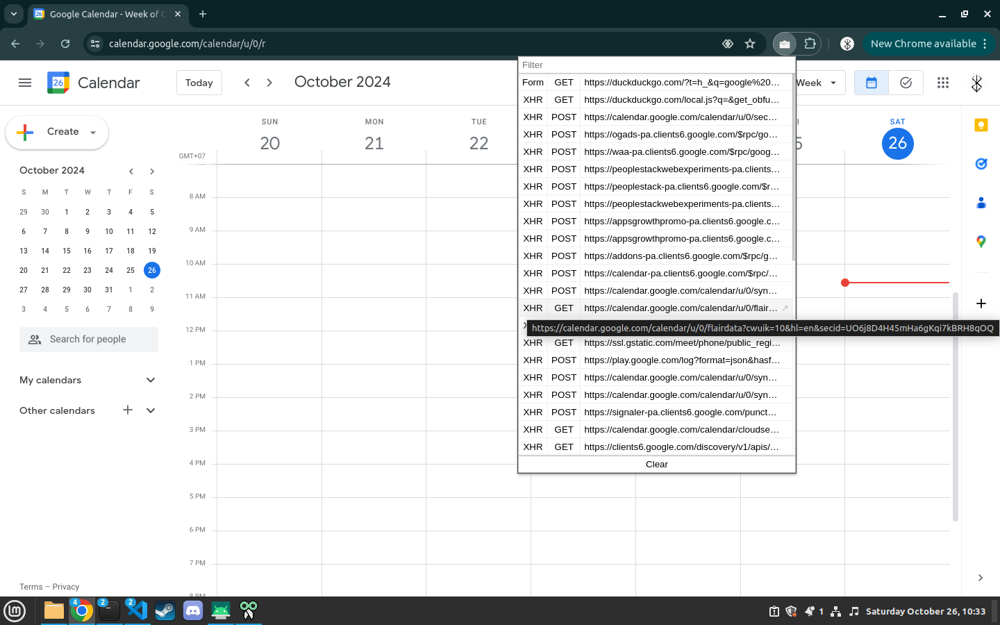
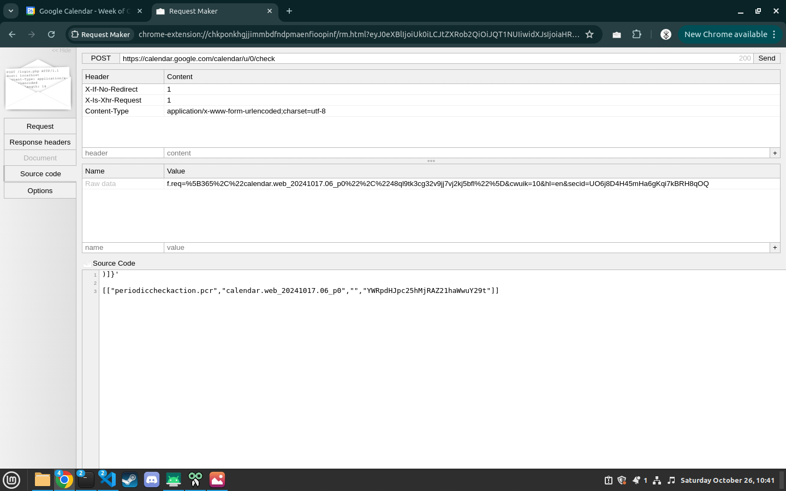
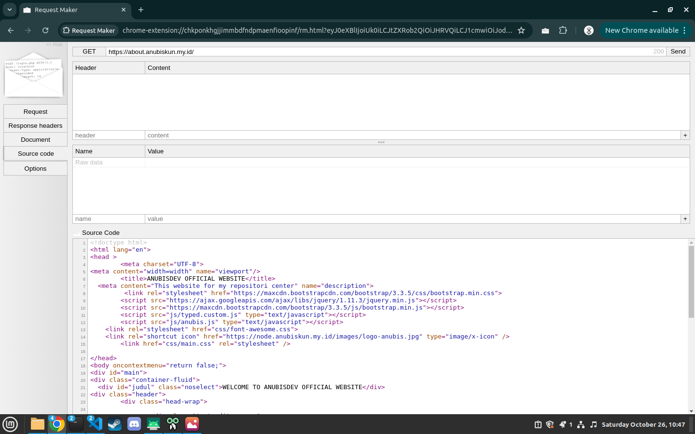
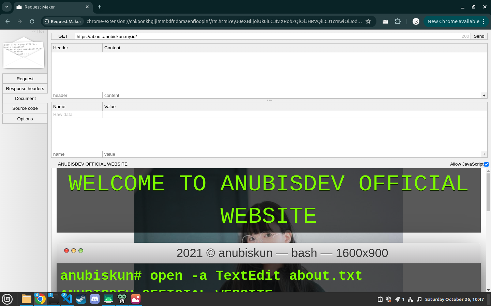
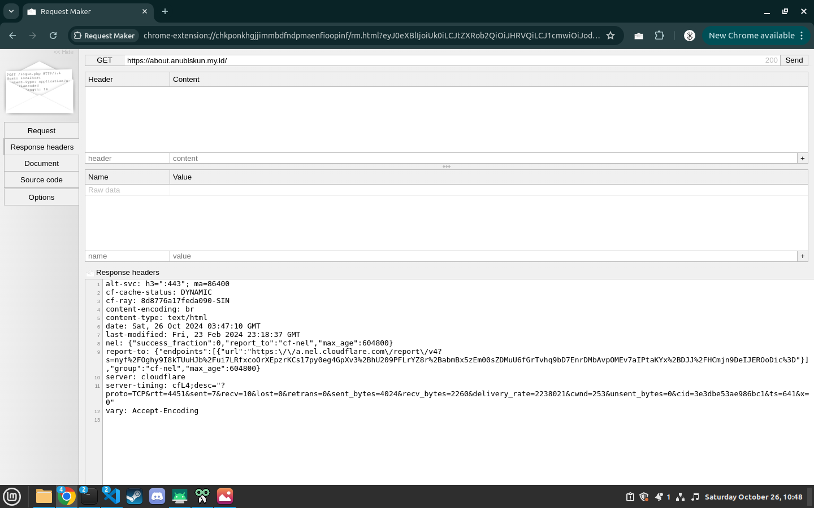

#

    
    
    

<!-- PROFILE -->
 

  
  <h3 align="center">ANUBISKUN</h3>
  

    <a href="mailto: anubiskun.xyz@gmail.com">Report Bug</a>
  

 

#
# Request Maker By anubiskun

This project is a continuation of the <a href="https://chrome.google.com/webstore/detail/kajfghlhfkcocafkcjlajldicbikpgnp">"Request Maker"</a> extension offered by Juho Nurminen from the chrome web store.

## my reasons for continuing this project:
1. I like this developer tool
2. the interface and features are simple and easy to learn
3. the available features are very helpful

## note
*This project is still under development, some functions are not working.

## HOW TO INSTALL
1. clone or Download zip this repository
2. if you download zip extract this file zip
3. open chrome, brave or etc browser from chromium
4. Go to developer tools , then turn on "developer mode"
5. click button "Load unpacked", then search your location clone or location extract this repository
6. then Select Folder in popup explorer window

#

  
Screenshot / Preview

  
  
  
  
  

#

Copyright &copy; <a href="https://github.com/anubiskun">ANUBISKUN</a>
